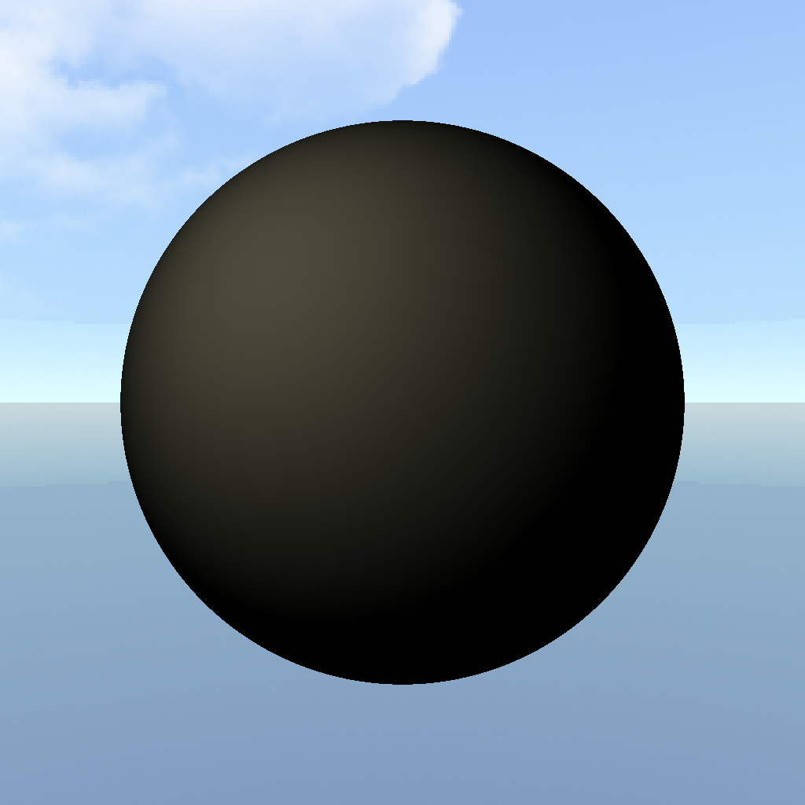
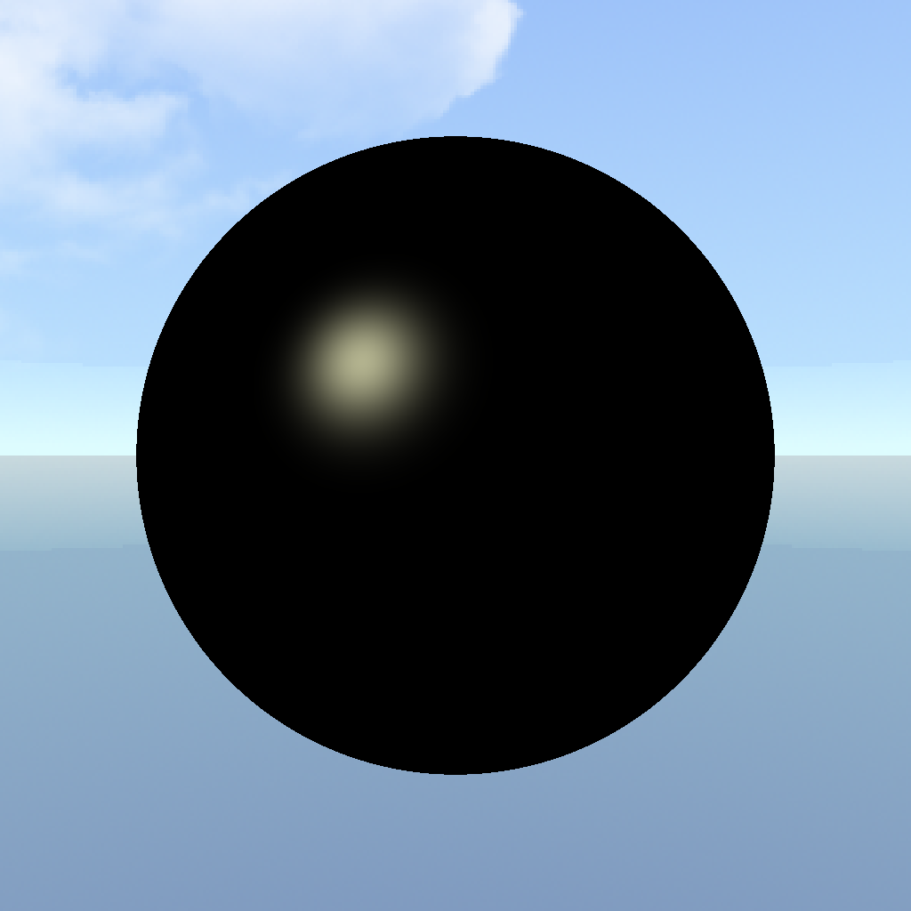
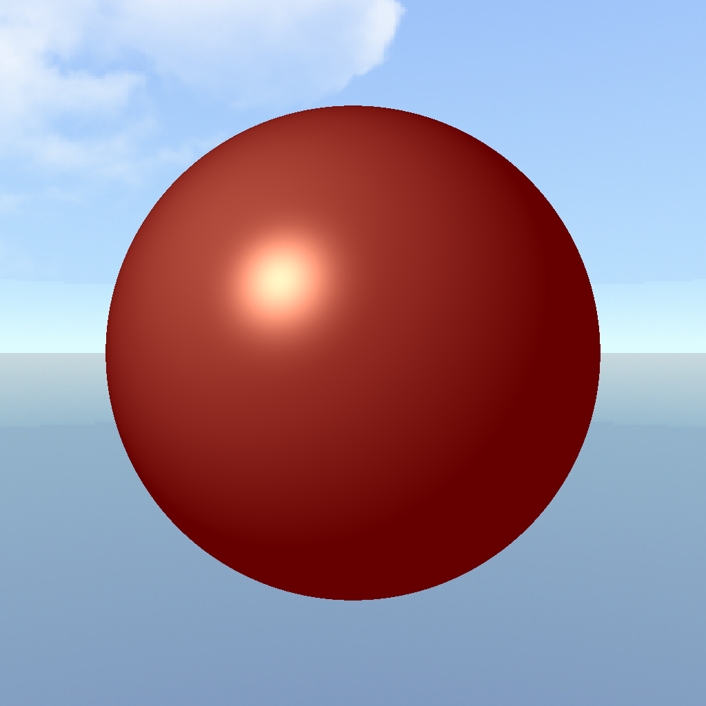
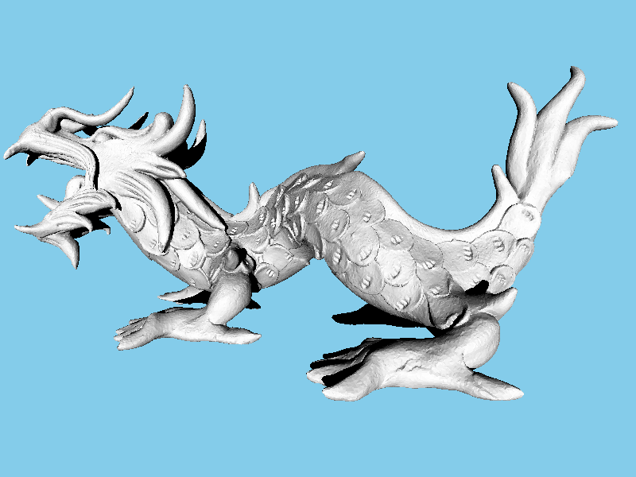
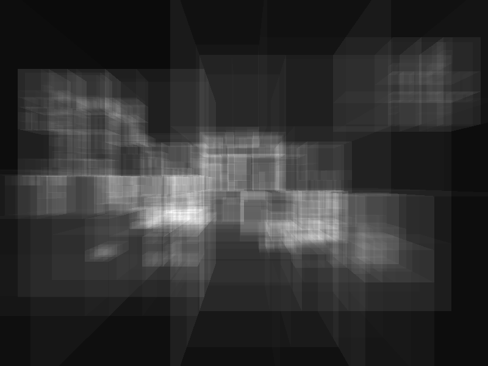

# Software Raytracing Engine
This is a software raytracing engine, fully written in C++17, with no dependencies or external libraries used. It uses backward cast raytracing, therefore keeping the balance between features of raytracing like correct reflections and refractions and avoiding the low performance of the Monte-Carlo method.

### How to launch it
If you are using MSVS, you can launch it from the project file. If not, you can compile all files in src and include folders, no additional libraries are needed. The project folder consists of a folder with code files, input and output folders. 

### Input
As input, the program uses a scene file, where all properties are listed. Depending on the scene, object files, textures, and skyboxes might also be loaded. Scene path can be passed as an argument value at program start. 

### Output
The output of the program is a single bpm file, containing a rendered image of a given resolution. BMP image format was chosen because of its simplicity. 

## Scene loader
In order to render something, we need information about scene. Those are stored in scene file. It is a text file that has several blocks: 
* Options :Here all types of settings are store as a pair of <key>=<value>. In the key field additional spaces and tabs may be inserted (they will be trimmed), but not on the side of value. You can see the full list in file full_scene.scene in the input folder 
* Object/Light: Each light or object block represents a single entity in the scene. Each line in this block will describe this entity. 
* End block: The scene file ends with an end block to indicate that all data has been read. 

## Features
### Multithreading
Ray tracing process for each pixel is a task that can be easily paralleled, so the program can use a custom amount of C++ threads to boost performance.
  
### Basic shapes
The simplest scene that can be rendered is a scene consisting of base shapes, like Sphere and Plane, and Point or Distant light sources. Here is an example of such a scene: 

Here you can see all 4 types of surfaces: 
* Diffuse - Collects info from all visible light sources 
* Phong - Combines three components: ambient, diffuse, specular 
* Reflective - Casts reflected ray for every ray fallen on it 
* Transparent - Using Fresnel model: combines refracted and reflected rays 
### How Phong illumination system works:
| Ambient | Diffuse | Specular | Final |
|:----------------:|:----------------:|:----------------:|:----------------:|
|||||

## Skybox
On the image below you can see the application of the skyboxes. Skybox is composed of 6 cube textures, and each time ray leaves the scene - we get color from one of those textures 

## Polygon Meshe
In order to use Polygon Mesh, we have to first load it. There are a lot of object types that can store 3d object data, but the type of my choice was .obj file. It is relatively simple yet powerful enough to implement a full specter of features. 
## Mesh features
### Backface culling 
Backface culling is a simple technique that can give a little performance boost at the ray-triangle intersection test. If ray faces 'another side' of triangles, the intersection will not be fully computed. However, if the model has some holes in it, it may give visual artifacts:
| Backface culling on (2.1 s) | Backface culling off (2.7s) |
|:----------------:|:----------------:|
|||

## Acceleration Structures 
They do not change anything in visual appearance, however, they can boost performance up to tens of times. It does so by creating a hierarchy of bounding boxes, which allows saving a lot of ray-triangle intersections. Each box may have two ancestor boxes, or store a set of triangles. This way we may text triangles only when the ray intersects the box. Left and Right boxes are separated by SAH - Surface Area Heuristic. This program has an option to visualise those bounding boxes:
| Rendered object | Low penalty (1) | Higher penalty (10) |
|:----------------:|:----------------:|:----------------:|
||||

The only parameter determining AC construction is a penalty. The deeper AC is in the hierarchy, the bigger the minimum amount of triangles it can store. Therefore the total amount of AC will change. However, it doesn't have much impact on performance.  
Model above containes 250'000 triangles. Without usage of AC render time was 356 seconds. With AC - only 6 seconds.

## Basic Shaders 
Mesh consists of polygons (triangles), and if we will draw them as they are we will receive an image that doesn't look nice. To fix it, we may use shaders. The most basic one will smoothen the surface by extrapolating the normal triangle vertices.  
| Flat shading | Vertex shading |
|:----------------:|:----------------:|
|||

## Texture maps 
The plain object is not very interesting and useful, so we can use texture maps to fix it. A texture map (sometimes called diffuse map) is an image storing information about objects' color. We can get them from texture coordinates, which are associated with each triangle. Also, those coordinates are normalized (from 0 to 1), therefore texture itself can have any size. The bigger the size - the better the quality.
| Texture file | Render without texture | Render with texture |
|:----------------:|:----------------:|:----------------:|
|||| 

## Normal maps 
Another tecnique similar to texture map is normal map. It can add to object more small details, without increasing the complexity of geometry. To use the tangent normal map we have to calculate tangent and bitangent for each triangle, and each time we'll need a normal we will transform the vector from the map into world space. In each pixel of such a map 3d vector is encoded, which shows direction of normal in tangent space.   
Following 2 images show normal view of object, which means that color of surface shows direction of normal in world space. In upper image we can see that object is smooth, while on picture below surface has much more details in it. It is the effect of normal map.

## Specular map 
We can add one more map to the object, which is specular map. This map is used for Phong shaded objects and can determine how reflective surface will be.

All 3 maps of the following model:
| Texture (diffuse) map | Normal map | Specular map |
|:----------------:|:----------------:|:----------------:|
|||| 
  
And with those 3 image we managed to enhance view of our model without significant performance loss.

  
## Area light 
The area light is the thing that can make a scene look much more plausible, but it also makes it much slower. In this engine, every area light source is parallelogram defined by its center position and sides vectors. Light quality is described by the number of samples per side of the parallelogram. So, the bigger the source - the more samples should be used and slower it will run.

| Original model | Low resolution of light source |
|:----------------:|:----------------:|
|||
| Small light source | Large light source |
|||

Also, if you are additionally interested in code and wish to expore it more, output folder has the call tree generated by Doxygen 
